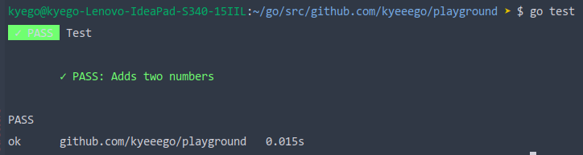

# Cogol

[](https://goreportcard.com/report/github.com/kyeeego/cogol)
[](https://opensource.org/licenses/MIT)
[](https://github.com/kyeeego/cogol/releases/latest)
[](https://github.com/kyeeego/cogol/actions/workflows/cogol.yml/badge.svg)


# Why Cogol?

Cogol is a beautiful, easy-configurable tool for writing unit-tests in ```Go``` programming language.

# Getting started

Install ```Cogol``` by running

```bash
$ go get github.com/kyeeego/cogol
```

Next, create typical ```*_test.go``` file and copy and paste the following code inside it.

```go
package test

import (
	"github.com/kyeeego/cogol"
	"testing"
)

func TestSomething(t *testing.T) {
	cgl := cogol.Init(t)

	g := cgl.Group("Test")
	{
		g.T("Adds two numbers", func(c *cogol.Context) {
			c.Expect(2 + 2).ToBe(4)
		})
	}

	cgl.Process()
}
```

Run it with 
```bash
$ go test
```

and get the following output



**You successfully wrote your first test with Cogol!**

# Documentation

* [Getting started](./examples/getting_started)
* [Assertions](./examples/assertions)
* [Storage](./examples/storage)
* [Logger](./examples/logger)
* [Achieving best performance](./examples/performance)
