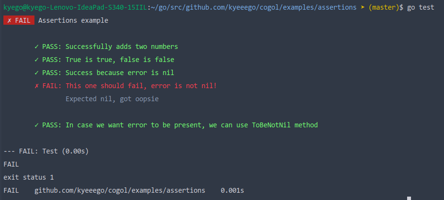

# Assertions

In this example you will see how to work with ```cogol``` built-in assertions

To create an assertion, you simply need to call ```Expect``` method of ```cogol.Context```, complete the assertion by calling some of ```assertion``` struct methods, and the error handling will be done by ```cogol```

## Expected output
After running ```go test``` in this directory, you should see the following results
    
