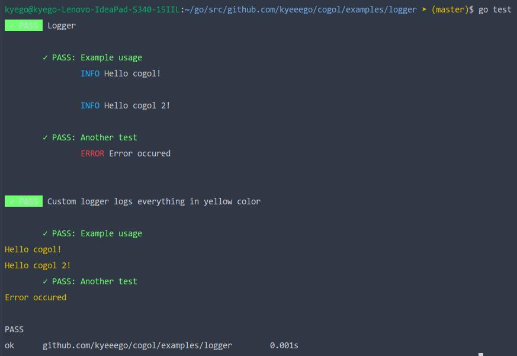

# Logging

Cogol does not allow using default external packages for logging, such as ```fmt``` or ```log```. Instead, you can you can use built-in logger by implementing the Context.Logger interface or simply using default implementation.
## Expected output
After running ```go test``` in this directory, you should see the following results
    
